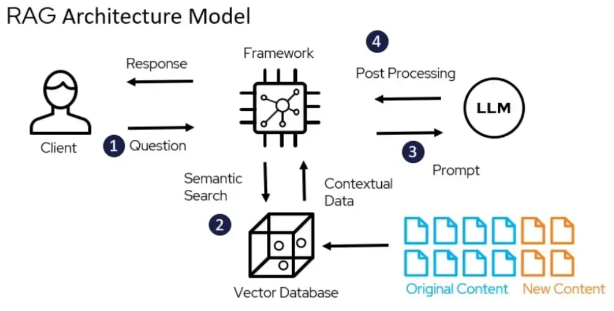

# RAGify - Advanced Retrieval-Augmented Generation Systems

The purpose of this repository is thus to provide a comprehensive and dynamic hub to showcase the latest retrieval augmented generation (RAG) systems, and to enhance their error reduction as well as processing speed and contextual richness. It’s the go-to resource for those looking to become an RAG master — an assembly of curated Jupyter notebooks for learning and teaching RAG concepts. If you’re trying your hand at retrieval-based approaches to improve AI models or are just a fungi out for some advanced RAG methods, this repository is your thing.

# Introduction 
The combination of generative AI and information retrieval using Retrieval-Augmented Generation (RAG) is a scientific and technological revolution. This repository features a hand-collated set of advanced techniques to greatly enhance your RAG system’s ability to provide more accurate, relevant, and overall system data.

You can find all the course notebooks in the notebooks directory. These notebooks cover various aspects of building and fine-tuning RAG models, providing both theoretical background and practical, hands-on examples.

We aim to create a useful resource for the research and practitioner community to take the RAG to the uttermost extreme. Together we hope to accelerate innovation in this fabulous area by fostering a collaborative environment.

# Key Features
🧠 State of the art RAG enhancements.
📚 Each technique has it’s own documentation.
🛠️ Practical implementation guidance.
🌟 Latest advancements, regular updates.

# Running the Notebooks
You have two options for running the code in these notebooks:

<b>Run Locally:</b> You can clone the repository and run the notebooks on your local machine. To do this, ensure you have a Python installation with the necessary dependencies.

<b>Run on Google Colab:</b> Each notebook includes a link at the top to open it directly in Google Colab, making it easy to run without local setup.

## Table of Contents

1. [01-Basic_Tutor.ipynb](https://github.com/Aadya-Madankar/RAGify/blob/main/01-Basic_Tutor.ipynb) - Introduction to RAG fundamentals
2. [02-Basic_RAG.ipynb](https://github.com/Aadya-Madankar/RAGify/blob/main/02-Basic_RAG.ipynb) - Basic RAG implementation
3. [03-RAG_with_LlamaIndex.ipynb](https://github.com/Aadya-Madankar/RAGify/blob/main/03-RAG_with_LlamaIndex.ipynb) - Using LlamaIndex in RAG systems
4. [04-RAG_with_VectorStore.ipynb](https://github.com/Aadya-Madankar/RAGify/blob/main/04-RAG_with_VectorStore.ipynb) - Integrating vector stores for enhanced retrieval
5. [05-Improve_Prompts_+_Add_Source.ipynb](https://github.com/Aadya-Madankar/RAGify/blob/main/05-Improve_Prompts_%2B_Add_Source.ipynb) - Refining prompts and adding source attribution
6. [06-Evaluate_RAG.ipynb](https://github.com/Aadya-Madankar/RAGify/blob/main/06-Evaluate_RAG.ipynb) - Evaluating RAG performance
7. [07-RAG_Improve_Chunking.ipynb](https://github.com/Aadya-Madankar/RAGify/blob/main/07-RAG_Improve_Chunking.ipynb) - Optimizing text chunking
8. [08-Finetune_Embedding.ipynb](https://github.com/Aadya-Madankar/RAGify/blob/main/08-Finetune_Embedding.ipynb) - Fine-tuning embeddings
9. [10-Adding_Reranking.ipynb](https://github.com/Aadya-Madankar/RAGify/blob/main/10-Adding_Reranking.ipynb) - Adding reranking mechanisms
10. [11-Adding_Hybrid_Search.ipynb](https://github.com/Aadya-Madankar/RAGify/blob/main/11-Adding_Hybrid_Search.ipynb) - Implementing hybrid search techniques
11. [12-Improve_Query.ipynb](https://github.com/Aadya-Madankar/RAGify/blob/main/12-Improve_Query.ipynb) - Improving query quality
12. [13-Adding_Router.ipynb](https://github.com/Aadya-Madankar/RAGify/blob/main/13-Adding_Router.ipynb) - Adding routing mechanisms
13. [14-Adding_Chat.ipynb](https://github.com/Aadya-Madankar/RAGify/blob/main/14-Adding_Chat.ipynb) - Incorporating chat functionalities
14. [15-Use_OpenSource_Models.ipynb](https://github.com/Aadya-Madankar/RAGify/blob/main/15-Use_OpenSource_Models.ipynb) - Using open-source models in RAG
15. [17-Using_LLMs_to_rank_chunks_as_the_Judge.ipynb](https://github.com/Aadya-Madankar/RAGify/blob/main/17-Using_LLMs_to_rank_chunks_as_the_Judge.ipynb) - Ranking chunks with LLMs
16. [Advanced_Retriever.ipynb](https://github.com/Aadya-Madankar/RAGify/blob/main/Advanced_Retriever.ipynb) - Advanced retrieval methods
17. [Agents_with_OpenAI_Assistants.ipynb](https://github.com/Aadya-Madankar/RAGify/blob/main/Agents_with_OpenAI_Assistants.ipynb) - Using agents with OpenAI assistants
18. [Audio_and_Realtime.ipynb](https://github.com/Aadya-Madankar/RAGify/blob/main/Audio_and_Realtime.ipynb) - Audio and real-time processing
19. [Basic_Agent_Example.ipynb](https://github.com/Aadya-Madankar/RAGify/blob/main/Basic_Agent_Example.ipynb) - Example of a basic agent
20. [Cohere_Model](https://github.com/Aadya-Madankar/RAGify/blob/main/Cohere_Better_Embedding_Model.ipynb) - Using Cohere model
21. [Open source Cohere model](https://github.com/Aadya-Madankar/RAGify/blob/main/Cohere_and_Open_Source_Embedding_Model.ipynb)- Using open source Cohere model
22. [Website Crawl](https://github.com/Aadya-Madankar/RAGify/blob/main/Crawl_a_Website.ipynb)- Crawl a website using RAG
23. [Dalle + Elevenlabs](https://github.com/Aadya-Madankar/RAGify/blob/main/DallE_3_and_ElevenLabs.ipynb)- Image and Voice generation
24. [Evaluating_and_Iterating_Prompts](https://github.com/Aadya-Madankar/RAGify/blob/main/Evaluating_and_Iterating_Prompts.ipynb)- Evaluate and Prompt Iteration
25. [GPT_4o_mini_Fine_Tuning](https://github.com/Aadya-Madankar/RAGify/blob/main/GPT_4o_mini_Fine_Tuning.ipynb)- Fine tunning GPT4o
26. [GraphRAG_Implementation](https://github.com/Aadya-Madankar/RAGify/blob/main/GraphRAG_Implementation.ipynb)- All about GraphRag
27. [HF_Inference](https://github.com/Aadya-Madankar/RAGify/blob/main/HF_Inference.ipynb)- Using HF_Inference
28. [Knowledge_Base_for_RAG](https://github.com/Aadya-Madankar/RAGify/blob/main/Knowledge_Base_for_RAG.ipynb)- Knowledge_Base_for_RAG
29. [Larger_Context_Larger_N](https://github.com/Aadya-Madankar/RAGify/blob/main/Larger_Context_Larger_N.ipynb)- Larger_Context model
30. [Limitations_and_weaknesses_of_LLMs](https://github.com/Aadya-Madankar/RAGify/blob/main/Limitations_and_weaknesses_of_LLMs.ipynb)- Limitations_and_weaknesses_of_LLMs
31. [LlamaIndex_101](https://github.com/Aadya-Madankar/RAGify/blob/main/LlamaIndex_101.ipynb)-LlamaIndex
32. [LlamaParse](https://github.com/Aadya-Madankar/RAGify/blob/main/LlamaParse.ipynb)- LlamaParse
33. [Long_Context_Caching_vs_RAG](https://github.com/Aadya-Madankar/RAGify/blob/main/Long_Context_Caching_vs_RAG.ipynb)- Long_Context_Caching_vs_RAG
34. [Metadata_Filtering](https://github.com/Aadya-Madankar/RAGify/blob/main/Metadata_Filtering.ipynb)- Data Filtering
35. [More_Api_And_Tools](https://github.com/Aadya-Madankar/RAGify/blob/main/More_Api_And_Tools.ipynb)- Multiple tools of RAG
36. [Observablity_And_Tracing](https://github.com/Aadya-Madankar/RAGify/blob/main/Observablity_And_Tracing.ipynb)- Observation of workflow with tracking
37. [Open_source_BetterEmbedding_Model](https://github.com/Aadya-Madankar/RAGify/blob/main/Open_source_BetterEmbedding_Model.ipynb)- Open_source_BetterEmbedding_Model
38. [Perplexity_Web_Api](https://github.com/Aadya-Madankar/RAGify/blob/main/Perplexity_Web_Api.ipynb)- Using Perplexity
39. [Prompting_101](https://github.com/Aadya-Madankar/RAGify/blob/main/Prompting_101.ipynb)- Prompting
40. [RAG_101](https://github.com/Aadya-Madankar/RAGify/blob/main/RAG_101.ipynb)- RAG
41. [Structured(JSON)_PDF_Data_Extraction](https://github.com/Aadya-Madankar/RAGify/blob/main/Structured(JSON)_PDF_Data_Extraction.ipynb) - PDF extraction
42. [Web_Search_API](https://github.com/Aadya-Madankar/RAGify/blob/main/Web_Search_API.ipynb)- Using Web api for search

# About This Repository
## - Audience: Designed for students and professionals interested in AI and natural language processing.
## - Topics Covered: The notebooks cover foundational and advanced concepts in retrieval-augmented generation, including:
    Data retrieval techniques
    Model integration with retrieval systems
    Practical applications of RAG in real-world scenarios
# Getting Started
Clone the repository and explore the notebooks at your own pace. Whether running them locally or in Colab, these notebooks will guide you step-by-step, enhancing your learning experience.

# Contributing
Contributions are welcome! If you have suggestions for improvements or new notebooks, please open an issue or submit a pull request.

# License
This project is licensed under the Apache-2.0 License. See the LICENSE file for details.
